# Near Real-Time Stock Market Analysis – Serverless Data Pipeline on AWS

## Overview  

In this project, I built a near real-time **stock market data streaming and analytics pipeline** on AWS that ingests market updates every 30 seconds, processes them, stores them for both operational access and analytics, and automatically detects market trends with alerting.

The system follows modern cloud-native best practices including:

- Serverless, event-driven architecture  
- Near real-time data ingestion and processing  
- Time-series storage optimized for querying  
- Data lake design for analytics  
- Automated monitoring and alerting  

-------------

## High-Level Architecture  

**Python Producer → Amazon Kinesis → AWS Lambda → DynamoDB & Amazon S3 → AWS Glue → Amazon Athena → Trend Analysis Lambda → SNS Alerts**

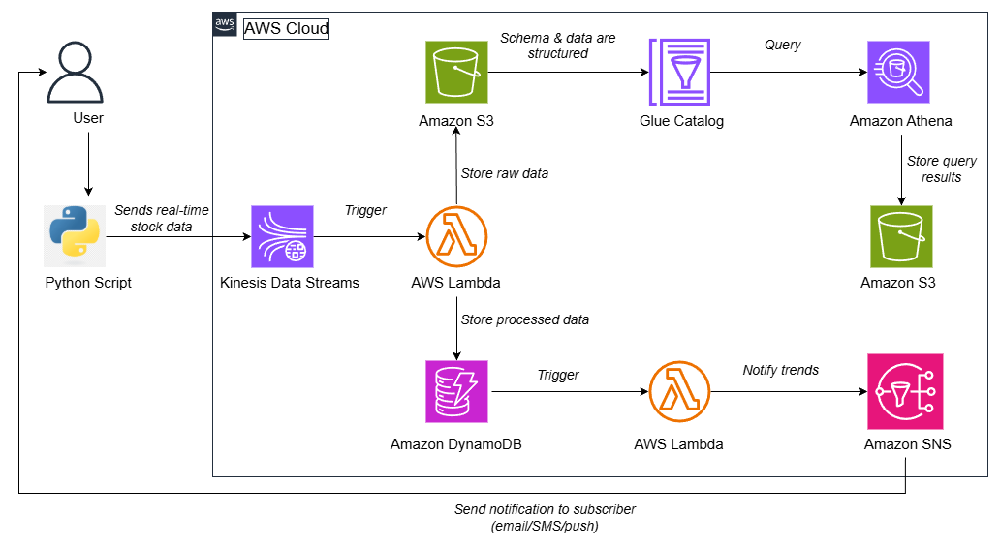

1. A Python script streams near real-time stock market data.  
2. Data is ingested into Amazon Kinesis Data Streams.  
3. AWS Lambda processes records in near real-time from Kinesis.  
4. Data is stored in DynamoDB (time-series) and S3 (raw data lake).  
5. AWS Glue catalogs S3 data.  
6. Amazon Athena enables SQL analytics on the S3 data.  
7. AWS Lambda analyses trends using DynamoDB Streams.
8. SNS sends automated alerts when trends are observed in DynamoDB.

-------------

## AWS Services Used  

- **Amazon Kinesis Data Streams** – Near real-time data ingestion  
- **AWS Lambda** – Serverless data processing and analytics  
- **Amazon DynamoDB** – Time-series storage for stock data  
- **Amazon S3** – Raw data lake storage  
- **AWS Glue** – Data catalog and schema management  
- **Amazon Athena** – SQL-based analytics on S3 data  
- **Amazon SNS** – Email alerts for trend changes  
- **AWS IAM** – Secure service permissions  

-------------

## How This Was Built  

### 1. Create Kinesis Data Stream  

A Kinesis Data Stream was created to ingest stock price updates in near real-time from the Yahoo Finance stock market API.  

The stream acts as a scalable buffer between data producers and processing consumers, enabling reliable ingestion even if downstream services experience delays.

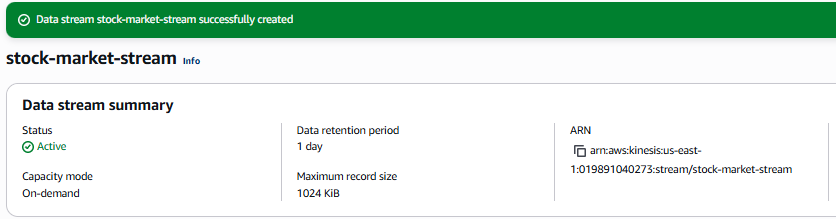

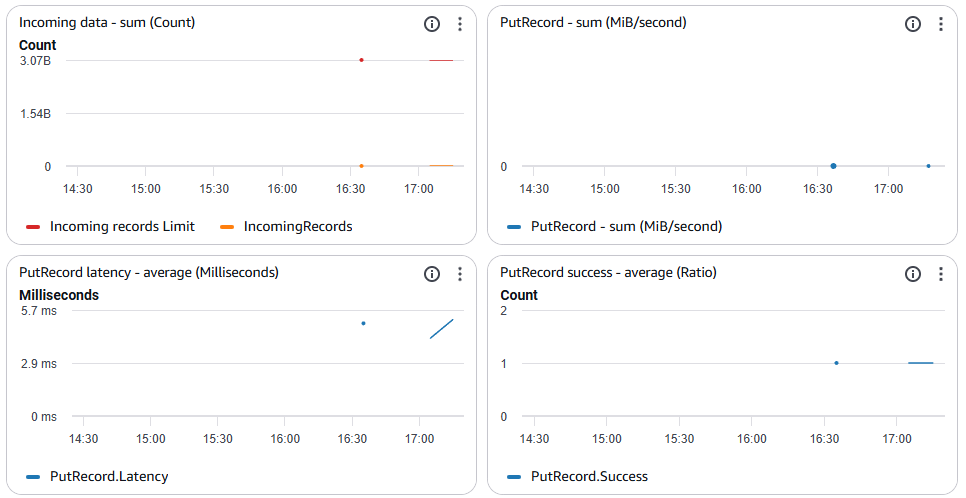

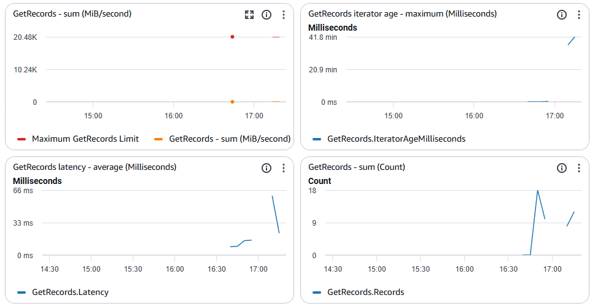


Using Kinesis enables:
- High-throughput data ingestion  
- Ordered records per stock symbol  
- Event-driven processing with Lambda
- Automatic scalability without managing infrastructure  

-------------

### 2. Build Python Stock Producer  

A local Python script `stream_stock_data.py` fetches near real-time market data using `yfinance` and sends structured JSON-encoded stock data into Amazon Kinesis Data Stream at 30-second intervals for multiple stock symbols (AAPL, MSFT, AMZN, NVDA, and GOOGL), simulating a real-time market data feed.

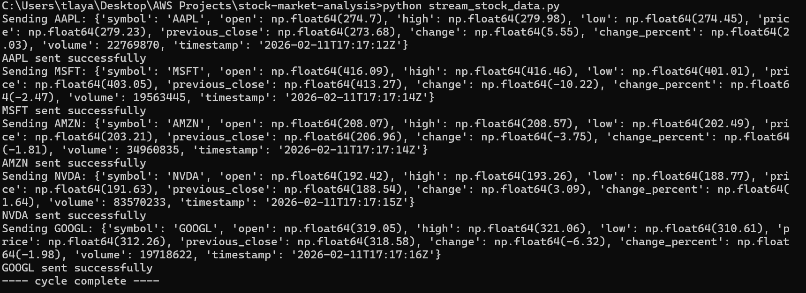

Each streamed record follows a structured JSON format:
```json
{
    "symbol": "AMZN",
    "open": 208.07,
    "high": 208.57,
    "low": 203.59,
    "price": 203.62,
    "previous_close": 206.96,
    "change": -3.34,
    "change_percent": -1.61,
    "volume": 28473366,
    "timestamp": "2026-02-11T16:37:23Z"
}
```
When the producer is executed locally, it continuously fetches live market data and publishes each stock update into the Kinesis stream

-------------

### 3. Design DynamoDB Time-Series Table  

A DynamoDB table was created to store processed stock records for fast, low-latency querying. It was designed using a composite primary key to efficiently support time-series access patterns:

- **Partition Key:** `symbol`  
- **Sort Key:** `timestamp`  

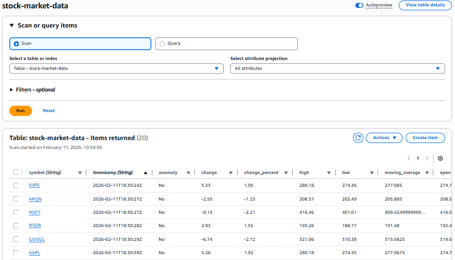

This design groups all records for a given stock symbol together while ordering them chronologically by timestamp.

-------------

### 4. Create S3 Data Lake  

Raw stock market records are stored in Amazon S3 to form a centralized data lake for long-term analytics and historical storage.

Data is organised using folder-based partitioning by stock symbol, enabling efficient querying and reduced scan costs when accessed through Athena.

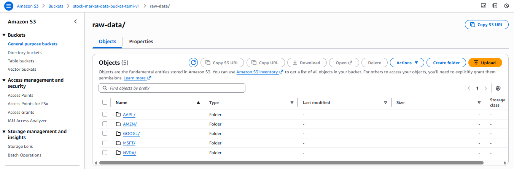

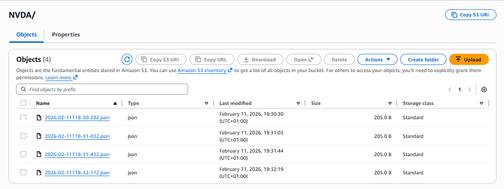

This setup provides:

- Durable, low-cost storage for large datasets
- Efficient & scalable querying through natural partitioning
- Clear separation between raw and processed data  

Using S3 as a data lake allows the pipeline to retain complete historical data while remaining flexible for future processing and analysis workloads.

-------------

### 5. Create Ingestion Lambda Function

An AWS Lambda function `ProcessStockData` is triggered by Amazon Kinesis to process incoming stock events in near real-time.

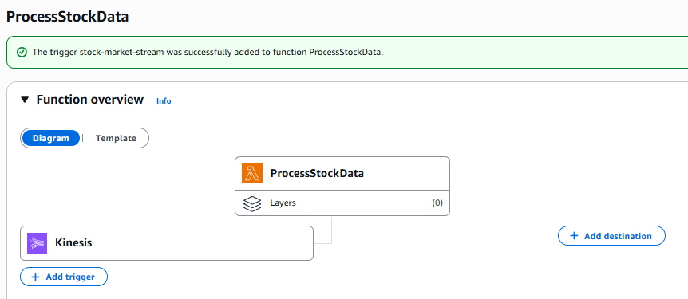

For each record, the function:
- Decodes the Kinesis payload
- Writes raw JSON data in Amazon S3 for long-term historical storage    
- Computes stock metrics including price change, percentage movement, and a simple moving average
- Flags anomalies when price movement exceeds ±5%
- Stores structured and enriched stock data in DynamoDB for fast operational access

This dual-storage approach separates transactional workloads from analytical workloads, allowing real-time applications and long-term analytics to scale independently.

It also preserves raw source data for reprocessing, auditing, and future transformations.

-------------

### 6. Catalog Data with AWS Glue  

A Glue Crawler scans the S3 bucket and creates a schema in the Glue Data Catalog.

This enables Athena to query raw S3 data using SQL.

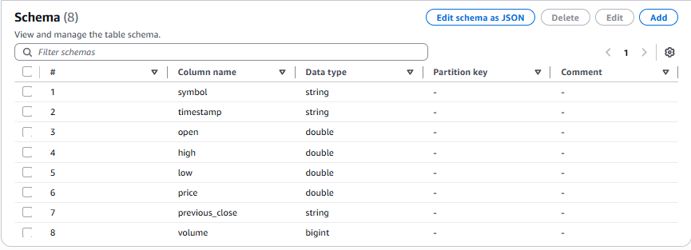

-------------

### 7. Create S3 Bucket for Athena Query Results

A second S3 bucket was created specifically to store Athena query outputs. Athena requires a result location to write query results before returning them in the console.

Keeping this bucket separate from the raw data lake helps organise analytics output.

-------------

### 8. Analyse Data with Athena  

Amazon Athena is used to run SQL queries directly against structured stock data stored in the primary S3 data lake. Because the data is catalogued in AWS Glue, Athena can treat the S3 dataset as a table that can be queried without requiring a traditional database. 

Athena reads raw stock data from the primary S3 data lake and writes query results to the dedicated Athena results S3 bucket created earlier.

This enables serverless analytics with no infrastructure to manage while keeping raw data and analytical outputs clearly separated.

Below are example analytical queries executed against the stock data lake:

Get Latest price per symbol
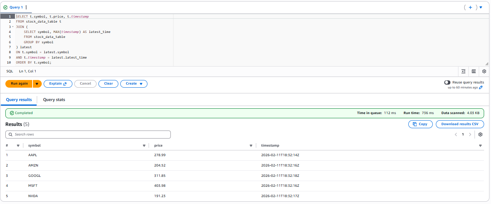

Get Average Trading Volume Per Stock
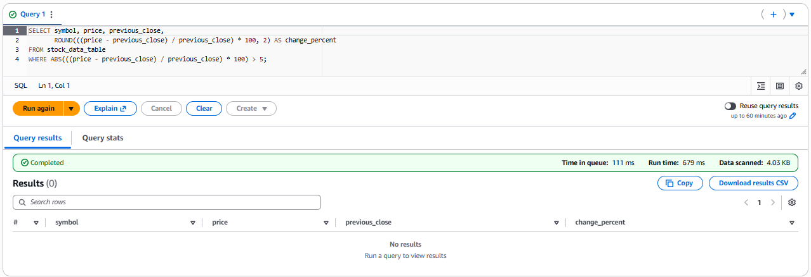

Find Anomalous Stocks (Price Change > 5%)
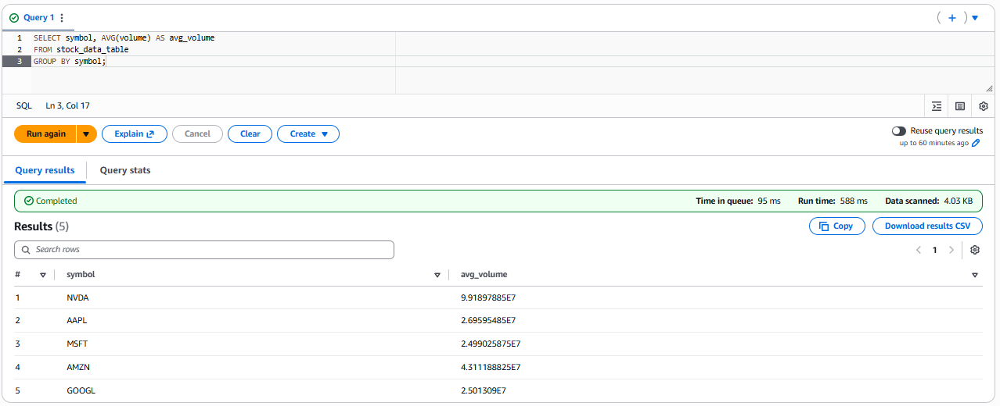

-------------

### 9. Enable DynamoDB Streams

DynamoDB Streams were enabled on the DynamoDB table created earlier to capture real-time item changes. This allows downstream services to react whenever new processed stock records are inserted.

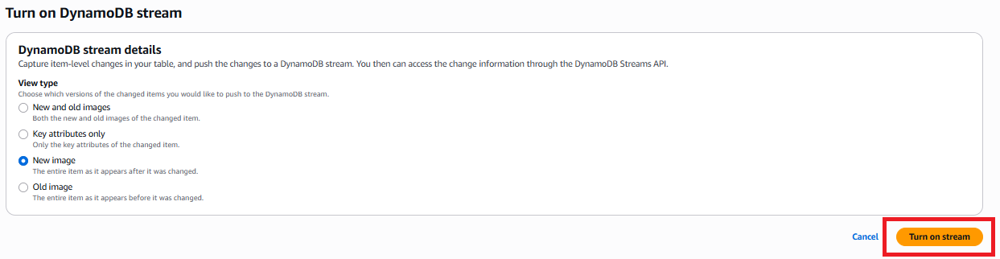

The stream captures the latest version of each record.

-------------

### 10. Create Stock Trend Alerts with Lambda & SNS

An SNS topic was created to send real-time alerts via email.

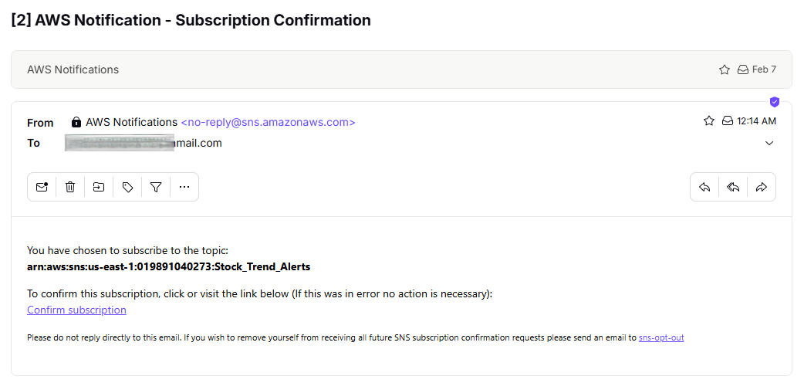

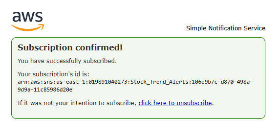

A second AWS Lambda function was created in AWS Lambda to perform stock trend analysis. This function is configured with DynamoDB Streams as its trigger, allowing it to react automatically whenever new processed stock records are inserted into the DynamoDB table.

The function:

-   Retrieves recent price records using DynamoDB partition key (`symbol`) and sort key (`timestamp`)  queries
-   Computes short-term and long-term moving averages (SMA 5 & SMA 20)
-   Detects crossover events:
    -   Uptrend (BUY signal)  
    -   Downtrend (SELL signal) 
-   Publishes alerts to SNS when trends change

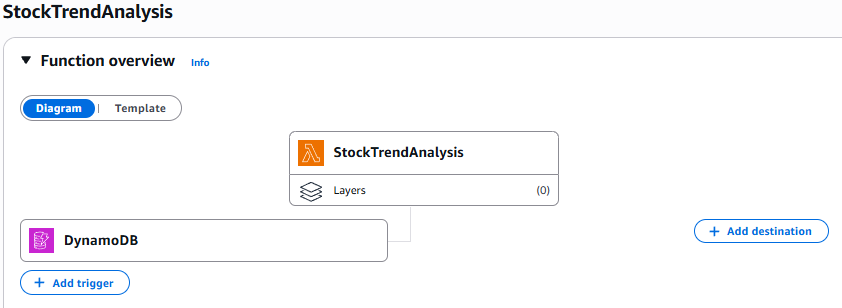
    
Subscribers receive immediate notifications when significant market movements occur.

-------------

## Key Design Decisions

- **Kinesis** for real-time ingestion instead of batch uploads
-   **DynamoDB** Query patterns for time-series efficiency
-   Separate raw and processed data layers
-   **Athena** for serverless analytics
-   **SNS** for event-driven alerts
-   Fully serverless architecture
    
----------

## What This Project Demonstrates

-   Near real-time streaming data pipelines on AWS
-   Serverless processing at scale
-   Time-series data modeling
-   Data lake architecture
-   SQL analytics on cloud storage
-   Automated monitoring systems

----------

## Conclusion

This project demonstrates how a complete near real-time data analytics system can be built using AWS managed services alone.

By layering ingestion, processing, storage, analytics, and alerting in a serverless architecture, the pipeline remains scalable, cost-effective, and easy to maintain.


The same design principles used here apply directly to financial systems, IoT pipelines, monitoring platforms, and large-scale event processing workloads.
